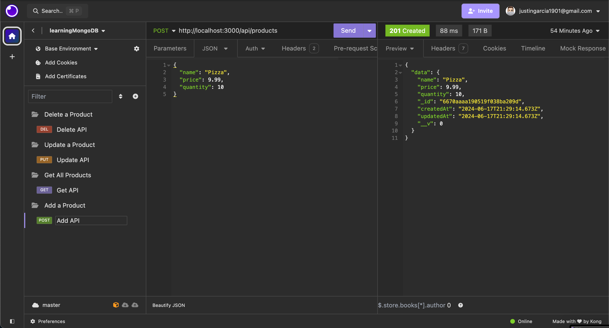
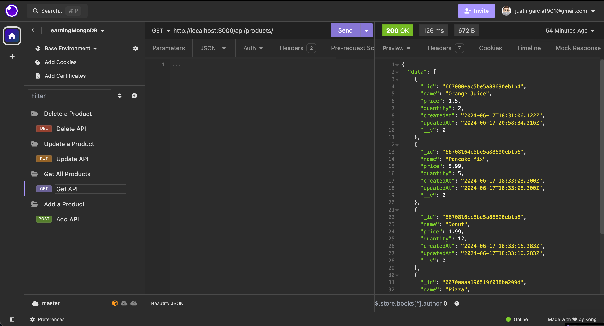
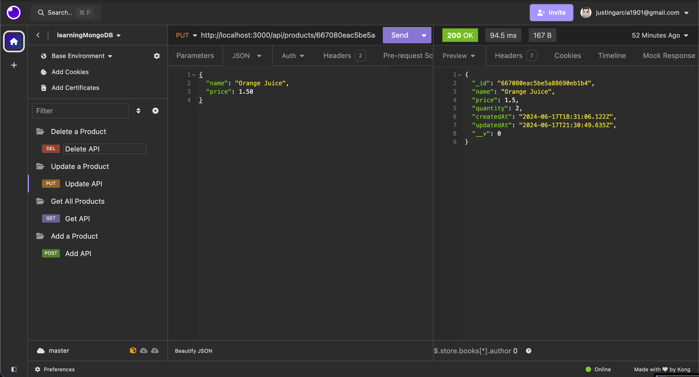
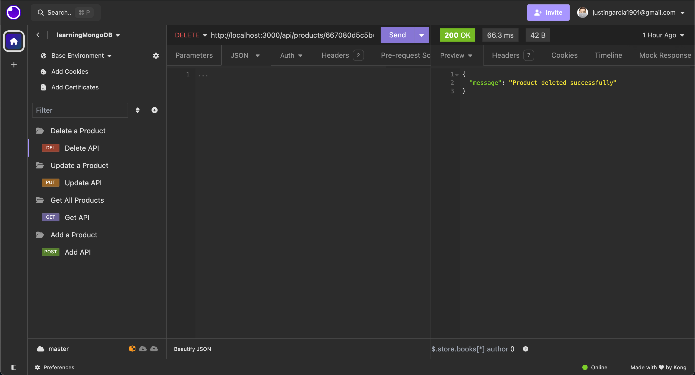

# mongoDB--Learning
Practicing the CRUD operations for mongoDB, Mongoose, Express, and Mongo Atlas

Utilizing express, nodemon, and mongoose, create a backend controller to access databases on MongoDB Atlas with APIs

Tested with Insomnia API Application

## INSOMNIA LAYOUT





## NOTES: 
Practiced with creating API routes, models, importing/exporting through node.js, utilizing dotenv for security, and functions such as; trycatch, async-await

Most problems encounter had to do with syntax and consistency errors as noted below: 
`MISTAKE`: Be sure to define app to run the server

1. `PROBLEM` Cannot PUT api/product/

- `SOLUTION`: Add a forward slash at the begining of the route (/api/product/)

2. `PROBLEM`:"Cannot access 'product' before initialization" 

- `SOLUTION`: Define product before the if statement (pertaining to the update and delete functionality)

3. `PROBLEM`: Unable to use the env variable to connect to the database through the string

- `SOLUTION`: npm install dotenv, and use the require('dotenv').config() to import the env variables


## BREAKDOWNS:
trycatch => 
```
const `function_name`  = async (req, res) => {
try {
    const {id} = req.params // only for update and delete function
    const `variable` = await `Model`.`CRUD operation`(`parameter`)
    res.status(201).json({Success_Message_Here})
} catch {
 res.status(500).json({message: error.message})
}
};
```

## Possible Parameters:
### Function_Name:  
    - getProducts // get all objects
    - getProduct // get single object
    - createProduct // create new object
    - updateProduct // update existing object
    - deleteProduct // delete existing object

 Named for C.R.U.D. (create, read, update, delete) functions

### Variable:  
    - product // manipulate singular object
    - products  // manipulate many object
    
 varies depending on functionality

### Model: 
    - Product  
Capitalize the object name

### Parameter: 
    - {} // used for get (all)
    - req.params.id // used for get (single) 
    - req.body // used for update
    - id // used for update and delete

   
    
